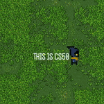
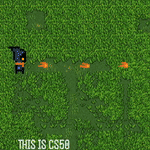
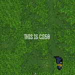
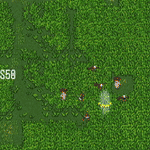
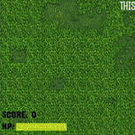

# 16-Bit Mage 

<br>

## [Video Demo](https://youtu.be/sGosR8WadHg)

> This is my CS50x Final Project for the year 2024. I chose to follow my personal interest in game development to create a 2D top down shooter inspired by the very popular Vampire Survivors.

---

### Table of Contents
Navigate to the section you're interested in.

1. [Description](#description)
2. [Installation and Setup](#installation-and-setup)
3. [Demonstration](#demonstration)
4. [Assets](#assets)
5. [Author Info](#author-info)

---

## Description

**16-Bit Mage** is a retro arcade-style 2D top-down shooter where you step into the shoes of a pixelated mage *(16x16 bits, to be exact)* battling against waves of increasingly challenging enemies with powerful fireballs. Set in a fantasy world brimming with peril, the game intensifies over time as enemies spawn more frequently and possess greater health and stats.

As the mage, you'll need to keep enemies at bay and strategically cast spells to survive the relentless assault. Earn points with each takedown and aim to beat your previous high score as the challenge escalates.

This project was crafted using the LÖVE2D framework, with the classic and anim8 modules enhancing class management and animations, respectively.

Small Disclaimer: 
I am fully aware that this project is far from being a commercial product. There are many features and mechanics that could be added, and I had numerous ideas emerge during development. Perhaps with a few more years of work, it could have evolved into the next Vampire Survivors? :copege:
That said, I chose to stay within the scope, core features, and timeframe I initially planned for this game. My primary goal from the start was to challenge myself with a project that would be more complex than the average CS50 student’s final project and to conclude this learning journey with a unique and ambitious endeavor.

#### Key Features:
- **Intuitive Top-Down Controls and Movement**: Easy-to-learn controls for smooth gameplay.
- **Diverse Enemy Types**: Each with unique animation sets and behaviors.
- **Precise Hitboxes**: Ensures accurate collision detection for fair play.
- **Retro Pixel Art Style**: Inspired by classic arcade games for a nostalgic feel.
- **Endless Waves of Enemies**: Increasing difficulty with enemies gaining health and damage over time.
- **Cooldown Mechanics**: Balances enemy attack frequency for a more strategic experience.
- **Player Invincibility Windows**: Provides brief moments of invulnerability to help manage intense situations.
- **High Score Tracking**: Saves and updates scores after each run, allowing players to track their progress.


#### Technologies

- [Lua](https://www.lua.org) (v5.3)
- [LÖVE](https://www.love2d.org) (v11.5)
- [Classic](https://github.com/rxi/classic)
- [anim8](https://github.com/kikito/anim8)

[Back To The Top](#read-me-template)

---

## Installation and Setup

#### Prerequisites
1. Download and Install LÖVE:
    - Go to the [offical LÖVE website](https://www.love2d.org) and download the version of LÖVE2D that matches your operating system (Windows, macOS, or Linux).
    - Install LÖVE following the provided instructions for your OS.
2. (Optional) Ensure Lua is Set Up:
    - LÖVE comes with Lua built-in, so you don't really have to install it separately, however if you plan to edit or extend any of the source code, it can be helpful to have Lua installed.
    - Download version 5.3 for the [offical Lua website](https://www.lua.org/download.html).

#### Cloning the Repository
1. Open your terminal of choice and navigate to the directory where you'd like to clone the project.
2. Run the following command to clone the repository:
```bash
git clone https://github.com/[YOUR_USERNAME]/16-bit-mage.git
```
3. Once cloned, navigate into the project folder.

#### Running the Game
You can 16-Bit Mage in to different ways:-
1. Simply drag the entire project folder over the LÖVE application icon.
2. Or just run the following command:
```bash
love .
```

#### Alternative: Run via VS Code
1. Download and install Visual Studio Code from [this link](https://code.visualstudio.com).
2. Install the following LÖVE extension from the marketplace:
    - Copy and paste this extension id:- pixelbyte-studios.pixelbyte-love2d
    - (This was the same extension I used during development)
3. Run the game by pressing the extension's run keybinds.
    - The default is **ALT + L** for Windows and **CMD + L** for MacOS

[Back To The Top](#read-me-template)

---

## Demonstration

<div align="center">
  <div style="display: inline-block; text-align: center; margin: 10px;">
    
    <p><b><i>WASD Movement</b></i></p>
  </div>
  <div style="display: inline-block; text-align: center; margin: 10px;">
    
    <p><b><i>Fireballs ~pew pew~</b></i></p>
  </div>
  <div style="display: inline-block; text-align: center; margin: 10px;">
    
    <p><b><i>Combat Mechanics</b></i></p>
  </div>
</div>

<div align="center">
  <div style="display: inline-block; text-align: center; margin: 10px;">
    
    <p><b><i>Collision Detection</b></i></p>
  </div>
  <div style="display: inline-block; text-align: center; margin: 10px;">
    
    <p><b><i>Dynamic HUD</b></i></p>
  </div>
</div>


---

## Assets
This project uses the following open-source assets; I possess zero artistic/design skills.
- [Mage](https://opengameart.org/content/16x16-mage)
- [Fireball](https://opengameart.org/content/pixel-art-spells)
- [Enemies](https://luizmelo.itch.io/monsters-creatures-fantasy)
- [Background](https://www.deviantart.com/txturs/art/Grass-Pixel-Art-Textures-512954148)
- [SFX](https://opengameart.org/content/512-sound-effects-8-bit-style)


[Back To The Top](#read-me-template)

---

## Author Info

- Linkedin - [Youssef Ashour](www.linkedin.com/in/youssef-ashour-596476310)
- Discord - [youssef.ashour](discordapp.com/users/428473626967146497)

[Back To The Top](#read-me-template)